# Volumetric Clouds for Unity URP

[English](#english) | [中文](#中文)

[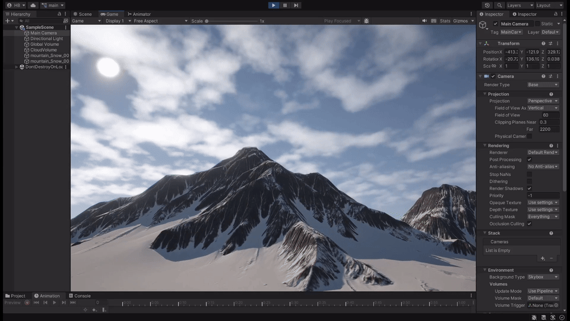](docs/media/volumetric-clouds-demo.mp4)

**[Watch the full demo: 25.87 seconds, 1080p / 查看完整演示视频](docs/media/volumetric-clouds-demo.mp4)**

## English

A real-time volumetric cloud rendering study for **Unity 2022.3.62f2 / URP 14.0.12**. The project combines offline GPU noise generation, a world-space cloud layer, light marching, temporal reconstruction and editor authoring tools.

The mountain in the recording is [Free Snow Mountain by ProAssets](https://assetstore.unity.com/packages/3d/environments/landscapes/free-snow-mountain-63002), not a cloud-rendering contribution. Its source files are excluded from this public repository under the Asset Store redistribution restrictions. The included `SampleScene` is a self-contained sky/cloud demo with the same cloud system. The original mountain scene remains in the local SCM project.

### Development History

This project was developed and checked in with **Unity Version Control / Plastic SCM** before publication on GitHub. The initial Git commit imports the release snapshot; it does not represent a one-session implementation. Actual changeset ids, timestamps, original comments and changed file paths are preserved in [the SCM history](docs/scm/HISTORY.md) and [machine-readable export](docs/scm/changesets.json). No backdated or reconstructed Git commits were created.

Development included reference-project study, iterative Unity testing and AI-assisted coding/debugging. The implementation details and limitations below describe the code in this repository rather than claiming feature parity with a reference renderer.

### Run the Project

1. Clone this repository and add its root folder to Unity Hub
2. Open with **Unity 2022.3.62f2** and let Unity restore the locked package dependencies
3. Open `Assets/Scenes/SampleScene.unity`
4. In **Edit > Project Settings > Quality**, select **High Fidelity**; use `Assets/Settings/URP-HighFidelity.asset` for the active render pipeline
5. Select `Assets/Settings/URP-HighFidelity-Renderer.asset` and expand **Cloud Raymarch Render Feature**; the material, `ShapeWorley128` and `DetailWorley64` are already assigned
6. Press Play, then select **CloudVolume** to adjust the cloud layer and lighting

Use a graphics backend supporting Compute Shaders and 3D textures. Validation uses Windows / Direct3D 11. Unity 6, Render Graph, XR and mobile backends have not been validated. `Library`, `.plastic`, user settings and editor caches are intentionally excluded.

### Rendering Pipeline

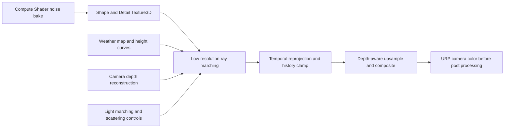

| Area | Implementation |
| --- | --- |
| Noise generation | An `8 x 8 x 8` Compute Shader dispatch writes a flattened `float4` voxel buffer, then an editor bake converts the result to RGBA32 `Texture3D` assets |
| Worley noise | Hashed periodic cell features and a bounded 27-neighbor F1 search; wrapped feature seeds preserve periodicity |
| Shape noise | Smooth value-noise FBM combined with Worley erosion; the implementation uses value noise, not gradient Perlin noise |
| Cloud density | World-space shape sampling, rotated secondary sampling domains, weather-driven coverage, height curves, detail and micro erosion |
| View integration | Analytic intersection with a horizontal cloud layer, depth-limited ray marching and Beer-Lambert transmittance; sample spacing covers the segment even when capped by Max Steps |
| Lighting | Secondary light march, Henyey-Greenstein phase, artistic ambient/occlusion controls, approximate multiple-scattering fill, powder and silver lining |
| Reconstruction | Reduced-resolution RGBA16F targets, previous view-projection reprojection, neighborhood history clamp, depth-aware upsampling and alpha sharpening |
| Runtime quality | Adjustable Render Scale, early transmittance termination and heuristic empty-region larger steps; camera changes invalidate history and Scene View disables accumulation |
| Scene integration | Depth-tested composition and approximate receiver darkening for cloud shadows; horizon tint blends the clouds into the sky |

### Authoring Tools

**Noise Generator**: open **Tools > Volumetric Clouds > Noise Generator**. Assign `CloudNoiseGenerator.compute`, choose Shape or Detail, resolution and seed, then generate an asset. Default paths separate Shape and Detail outputs. Regenerating an existing texture preserves its GUID and renderer references. GPU readback is synchronous during the offline bake; it is not a per-frame runtime compute operation.

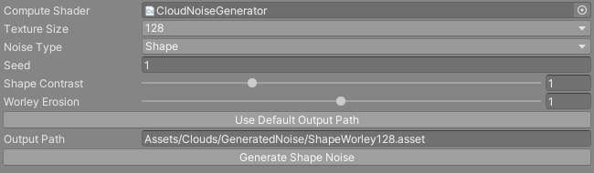

**3D Noise Preview**: open **Tools > Volumetric Clouds > Noise Preview**. Assign a generated `Texture3D`, move the slice slider and inspect individual RGBA channels.

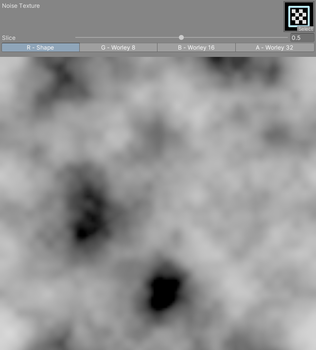

| Shape: mid-depth R slice | Detail: mid-depth R slice |
| --- | --- |
| 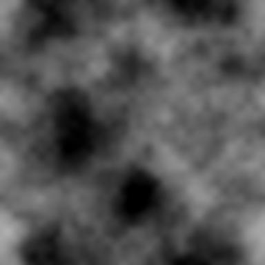 | 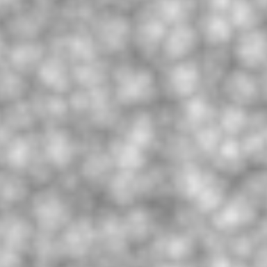 |

**Weather Map Generator**: open **Tools > Volumetric Clouds > Weather Map Generator** to bake a grayscale 2D coverage map. **Generate Dither Texture** writes the interleaved-gradient dither texture. Weather-map sampling uses mixed domains to reduce repetition; the generated 2D map is not mathematically guaranteed to be seamless.

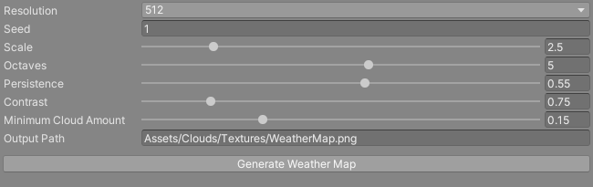

**CloudVolume Inspector** groups layer, shape/erosion, weather/wind, lighting, reconstruction and debug controls. Changing the preset dropdown loads its stored values. **Apply Preset saves the current parameters into the selected preset**. Portfolio Look and Performance Preview apply quality configurations; Final Debug restores final composition; Reset Built-In Presets replaces the saved preset bank with defaults.

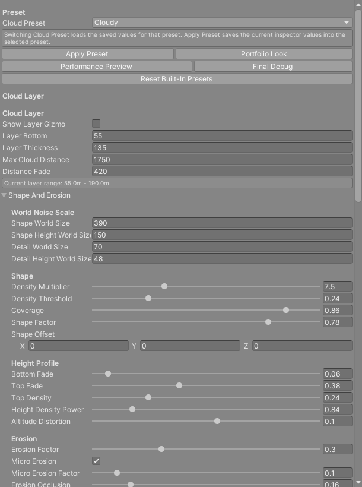

| Preset | Intended look |
| --- | --- |
| Sparse | Scattered clouds and visible sky |
| Cloudy | A broader cloud field with gaps |
| Overcast | Nearly continuous cloud cover |
| Stormy | Dense clouds with stronger internal contrast |
| Custom | Direct parameter authoring |

### Debug Views

The inspector exposes Final, CloudOnly, Alpha, Lighting, Weather, Height and RaySteps. These captures are rendered from the included public demo scene; they are distinct from the mountain recording above.

| Final cloud layer | Alpha | Lighting | Ray steps |
| --- | --- | --- | --- |
| 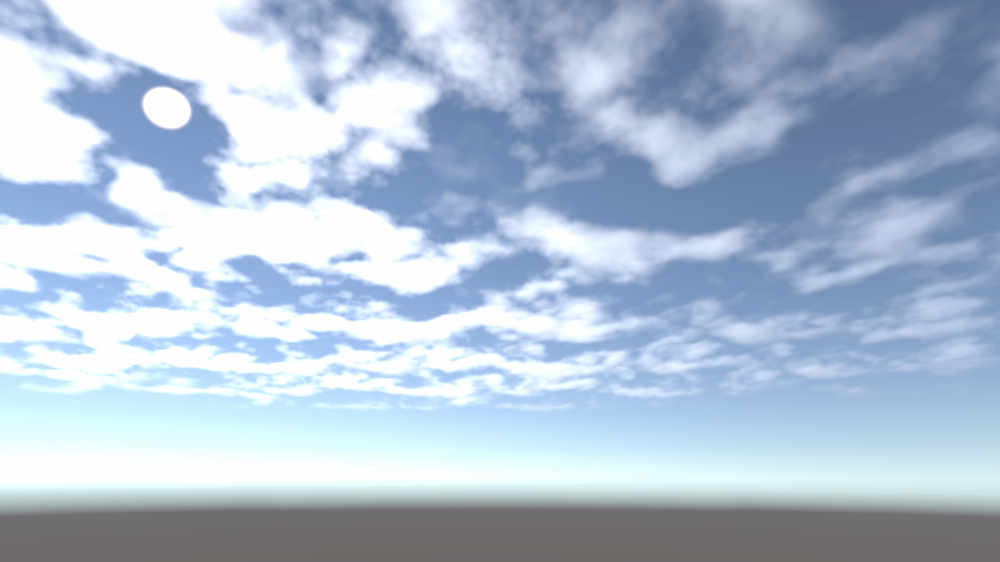 | 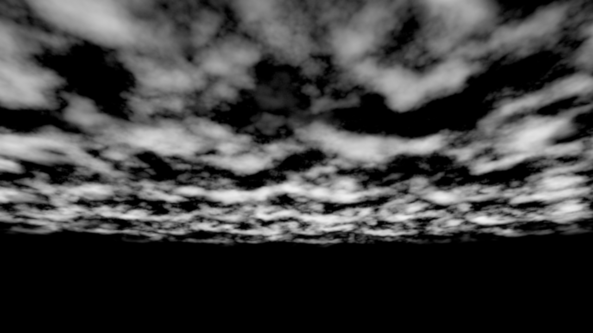 | 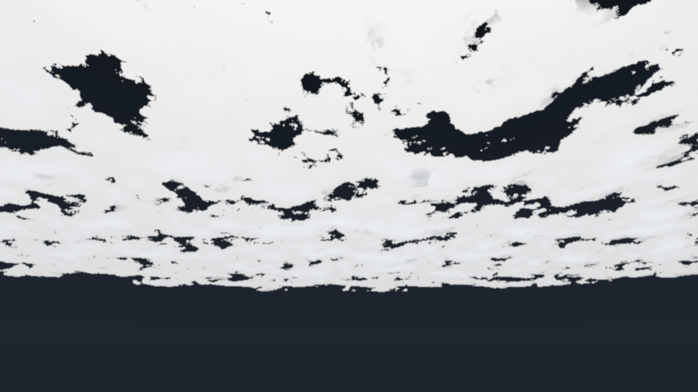 | 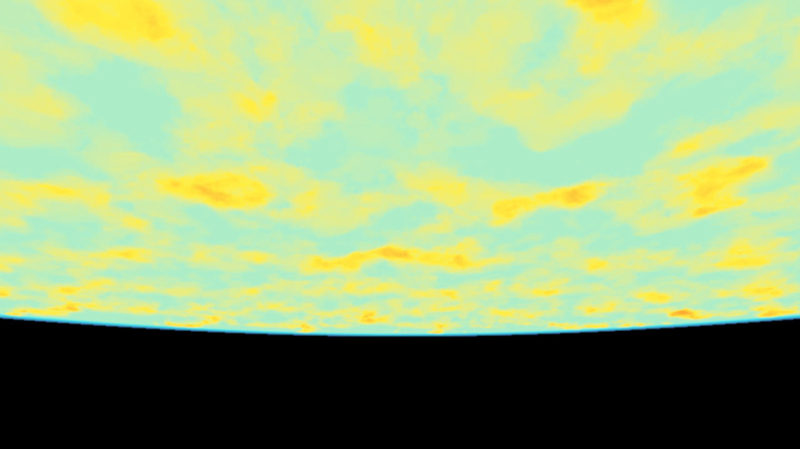 |

### Source Map

| File | Responsibility |
| --- | --- |
| [CloudNoiseGenerator.compute](Assets/Clouds/Shaders/CloudNoiseGenerator.compute) | Hashing, periodic value/Worley noise and voxel generation |
| [CloudNoiseGeneratorWindow.cs](Assets/Clouds/Editor/CloudNoiseGeneratorWindow.cs) | Offline bake, quantization and asset persistence |
| [CloudNoisePreviewWindow.cs](Assets/Clouds/Editor/CloudNoisePreviewWindow.cs) | Slice/channel preview |
| [CloudVolume.cs](Assets/Clouds/Runtime/CloudVolume.cs) | Serialized cloud parameters, curves and editable presets |
| [CloudVolumeEditor.cs](Assets/Clouds/Editor/CloudVolumeEditor.cs) | Custom inspector and authoring commands |
| [CloudCurveTexture.cs](Assets/Clouds/Runtime/CloudCurveTexture.cs) | Encodes height curves into a one-dimensional lookup texture |
| [CloudRayMarchRenderFeature.cs](Assets/Clouds/Runtime/CloudRayMarchRenderFeature.cs) | URP pass scheduling, resources, history and material parameters |
| [CloudRayMarch.shader](Assets/Clouds/Shaders/CloudRayMarch.shader) | Density evaluation, view/light integration and three rendering passes |

### Limitations and Validation

The current renderer uses a horizontal layer, not a planetary spherical atmosphere. It does **not** implement an SDF volume or conservative sphere tracing. Empty-space skipping uses a heuristic, so thin cloud features can be missed at coarse settings. Multiple scattering, aerial perspective and cloud shadows are approximations, not a full atmospheric transport solver. Temporal reprojection uses scene depth and shared history; fast motion, animated clouds and multiple cameras remain stress cases. Height-curve textures are rebuilt during material updates and have not been performance-profiled.

Release checks and their scope are recorded in [the validation notes](docs/VALIDATION.md). No FPS or GPU timing is claimed without profiling. See [third-party notices](THIRD_PARTY_NOTICES.md) for reference attribution and asset exclusions.

---

## 中文

基于 **Unity 2022.3.62f2 / URP 14.0.12** 的实时体积云渲染学习与作品集项目，包含离线 GPU 噪声生成、世界空间云层、视线与光线步进、时间重建及编辑器工具。

视频中的雪山来自 ProAssets 的 [Free Snow Mountain](https://assetstore.unity.com/packages/3d/environments/landscapes/free-snow-mountain-63002)，不属于本项目实现的体积云功能。按照 Asset Store 的源资源再分发限制，公开仓库不包含雪山模型与贴图，提供使用相同云渲染系统、可独立运行的天空演示场景。原始雪山场景保留在本地 SCM 工程中。

### 开发记录

本项目发布到 GitHub 之前，使用 **Unity Version Control / Plastic SCM** 进行开发与提交。GitHub 首次提交是已有版本的迁移快照，不代表所有功能在一次操作中完成。[SCM 历史说明](docs/scm/HISTORY.md)和 [JSON 记录](docs/scm/changesets.json)保留真实变更集编号、时间、原始日志和变更路径，没有伪造或回填历史 Git 提交。

开发过程包含参考项目学习、Unity 中的迭代验证及 AI 辅助编码与调试。本文按实际源码介绍技术点与限制，不宣称已经与参考渲染器完全等效。

### 运行步骤

1. 克隆仓库，在 Unity Hub 中添加仓库根目录
2. 使用 **Unity 2022.3.62f2** 打开，等待锁定版本的包依赖恢复
3. 打开 `Assets/Scenes/SampleScene.unity`
4. 在 **Edit > Project Settings > Quality** 选择 **High Fidelity**，确认使用 `Assets/Settings/URP-HighFidelity.asset`
5. 选择 `Assets/Settings/URP-HighFidelity-Renderer.asset`，展开 **Cloud Raymarch Render Feature**，云材质、ShapeWorley128 和 DetailWorley64 已配置
6. 点击 Play；选择 Hierarchy 中的 **CloudVolume** 即可调整云层与光照

需要支持 Compute Shader 与 3D 纹理的图形后端。发布验证使用 Windows / Direct3D 11，尚未验证 Unity 6、Render Graph、XR 或移动端。仓库包含 Assets、Packages、ProjectSettings 及必要 `.meta`，不提交 Library、SCM 元数据和用户缓存。

### 核心技术

| 环节 | 实现方式 |
| --- | --- |
| 离线噪声生成 | Compute Shader 使用 8×8×8 线程组并行计算，通过展平的 float4 缓冲区回读，量化并保存 RGBA32 Texture3D |
| Worley 噪声 | Hash 生成周期细胞特征点，搜索 27 个相邻细胞计算 F1 距离，细胞种子环绕处理用于保持周期性 |
| 形状噪声 | 平滑 Value Noise FBM 与 Worley 侵蚀组合；这里使用 Value Noise，而非梯度 Perlin Noise |
| 密度场 | 世界空间采样、旋转的第二采样域、天气覆盖图、高度曲线、细节侵蚀与微侵蚀 |
| 视线积分 | 水平云层解析求交、场景深度限制、Beer-Lambert 透过率积分，步数受限时重新分配采样间距以覆盖射线区间 |
| 云内光照 | 朝太阳的二次步进、Henyey-Greenstein 相位函数、环境遮蔽，以及近似多重散射、粉末效应和银边控制 |
| 重建合成 | 低分辨率 RGBA16F 渲染、上一帧矩阵重投影、邻域历史钳制、深度感知上采样与透明度锐化 |
| 质量控制 | Render Scale、低透过率提前终止、启发式空区增大步长，相机切换时重置历史，Scene View 关闭时间累积 |
| 场景整合 | 深度遮挡合成、近似接收面云影以及地平线颜色融合 |

### 工具与预设

**噪声生成器**位于 **Tools > Volumetric Clouds > Noise Generator**。拖入 Compute Shader，选择 Shape / Detail、分辨率与种子后生成。两类纹理默认分别命名；重复生成同一纹理时保留 GUID，避免渲染配置引用丢失。回读属于离线编辑器操作，不是运行时每帧生成。

**3D 噪声预览器**位于 **Tools > Volumetric Clouds > Noise Preview**，可以拖入 Texture3D，移动切片位置并分别查看 RGBA 通道。上方英文部分展示真实工具截图和噪声中间切片。

**天气图生成器**位于 **Tools > Volumetric Clouds > Weather Map Generator**，生成控制大尺度云覆盖的二维灰度图。**Generate Dither Texture** 生成步进抖动纹理。当前二维天气图不保证数学上的无缝周期，多采样域用于减轻重复感。

**CloudVolume 自定义 Inspector** 提供云层、形态侵蚀、天气风场、光照、重建与调试控制。切换预设会载入其保存值，**Apply Preset 用于把当前参数保存到选中的预设**。Portfolio Look 应用展示参数，Performance Preview 应用预览参数，Final Debug 回到最终合成，Reset Built-In Presets 重置保存的预设库。

| 预设 | 中文含义 |
| --- | --- |
| Sparse | 稀疏云，天空留白较多 |
| Cloudy | 多云，云块较广但保留空隙 |
| Overcast | 阴天，接近连续覆盖 |
| Stormy | 风暴云，密度和内部明暗更强 |
| Custom | 自定义参数 |

### 调试与实现边界

提供 Final、CloudOnly、Alpha、Lighting、Weather、Height、RaySteps 调试视图。上方的四张调试图来自仓库中可运行的公开场景，与雪山演示视频区分展示。核心脚本与 Shader 的职责映射见英文部分的 Source Map。

当前使用水平云层，未实现行星球壳大气、SDF 体积或保守距离场步进。空区跳步是启发式优化，粗步长可能遗漏细小云块。多重散射、空气透视与云影均为近似模型。时间重投影基于场景深度并共用历史，高速运动、动态云与多相机仍有待强化；高度曲线纹理更新尚未做性能测量。

验证项目与范围见 [验证说明](docs/VALIDATION.md)，未提供未经测量的 FPS 或 GPU 耗时。参考项目、第三方资源及公开版本排除项见 [第三方说明](THIRD_PARTY_NOTICES.md)。
